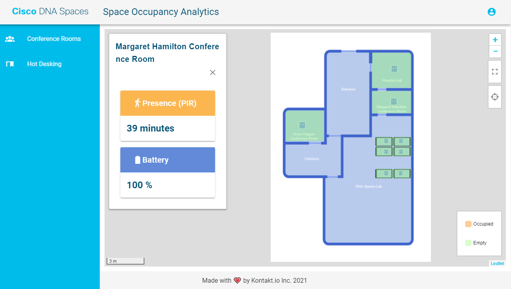

# Occupancy sensor demo app

You can use this app to visualise occupancy sensor data from CISCO DNA Spaces Firehose stream.



## What do you need?

- DNA Spaces account with access to the Firehose API (Api Key).
- Infrastructure to run Docker image for Firehose connection proxy.

## Build and run

Build UI:  
```
npm install
npm run build
```

Build docker image:  
```
docker build -t demoapp-space-occupancy -f deploy\Dockerfile .
```

Run docker container:  
```
docker run -p 5050:80  \
    --env LIVE_STREAM_URL=http://partners.dnaspaces.io \
    --env LIVE_STREAM_API_KEY=YOUR_DNAS_API_KEY \
    --env VUE_APP_LIVE_STREAM_URL_FOR_WEB=/api/partners/v1/firehose/events \ 
    --env WEB_ASSETS_CDN="/" \ 
    demoapp-space-occupancy
```

## Components

### Firehose API Proxy

You need a proxy backend to DNA-S Firehose API to perform authentication and allow UI app to connect from web browser bypassing CORS policy.

Following environment variables are needed:  
* LIVE_STREAM_URL - DNA-S Firehose http API url,
* LIVE_STREAM_API_KEY - DNA-S Api Key,
  
You can use the same container to serve UI application at the same time, in that case you should specify following:  
* VUE_APP_LIVE_STREAM_URL_FOR_WEB - configure UI application to use following URL to connect the Firehose API stream, you can use value `/api/partners/v1/firehose/events` to connect to the same nginx container as the one serving the app
* WEB_ASSETS_CDN - optional address for web assets CDN

#### Command to build image

`docker build -t demoapp-space-occupancy -f deploy\Dockerfile .`

#### Command to run container

```
docker run -p 5050:80  \
    --env LIVE_STREAM_URL=http://partners.dnaspaces.io \
    --env LIVE_STREAM_API_KEY=YOUR_DNAS_API_KEY \
    --env VUE_APP_LIVE_STREAM_URL_FOR_WEB=/api/partners/v1/firehose/events \ 
    demoapp-space-occupancy
```

### UI Application

Application is reading local file to get its configuration. File `src/components/LocationStore.js` contains static info for the map and rooms. 

Most important elements:

- `LocationStore.floors[0].imageXyGeojson` - floor map image boundary, units are meters
- `LocationStore.zones` - these are elements for the side menu, `xyGeojson` is used to zoom-on, on click
- `LocationStore.floors[0].rooms[]` - these are rooms with sensors, each desk should be also represented as room in open space
- `LocationStore.floors[0].rooms[].name` - name displayed in tooltip on hover
- `LocationStore.floors[0].rooms[].roomSensors[].trackingId` - MAC address of a sensor
- `LocationStore.floors[0].rooms[].xyGeojson` - room area geoJSON, unit are meters, empty `properties` object must be provided, since it will be populated with working data.

Map image is loaded from path `/map_images/lab_occupancy_v3.png`, you can change it here: `src/components/OccupancyMap.vue:10`. You can use WEB_ASSETS_CDN environment variable to get map image from different source.  

#### Commands to build the UI app

```
npm install
npm run build
```

Compiles and hot-reloads for development
```
npm run serve
```
